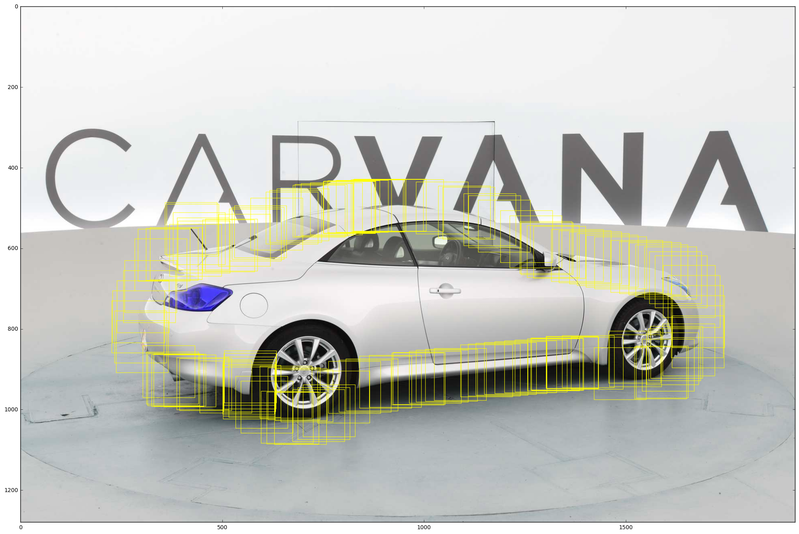

# PatchesNet
Carvana Boundaries Refinement


```python
import matplotlib.pyplot as plt
import numpy as np
import glob
import cv2
import os

N = 64

ids = [os.path.basename(x) for x in glob.glob('/data/pavel/carv/train/*09*.jpg')]
ids = [x.split('.')[0] for x in ids]

for id in ids[15:16]:
    mask = cv2.imread('/data/pavel/carv/train_masks/%s_mask.png' % id, cv2.IMREAD_GRAYSCALE) / 255.0
    mask = np.pad(mask, ((0,0), (1,1)), 'constant')
    
    border = np.abs(np.gradient(mask)[1]) + np.abs(np.gradient(mask)[0])
    border = np.select([border == 0.5, border != 0.5], [1.0, border])
    
    img = cv2.imread('/data/pavel/carv/train/%s.jpg' % id)
    img = np.pad(img, ((0,0), (1,1), (0,0)), 'constant')
    
    height, width = mask.shape
    
    i = 0
    for x, y in zip(np.nonzero(border)[0], np.nonzero(border)[1]):
        if i%50 == 0:
            cv2.rectangle(img,(y-N-1,x-N-1),(y+N,x+N),(255,255,0),1)
        i = i +1
    
    plt.figure(figsize=(25, 25))
    plt.imshow(img)
    plt.show()
    
```





```python

```
